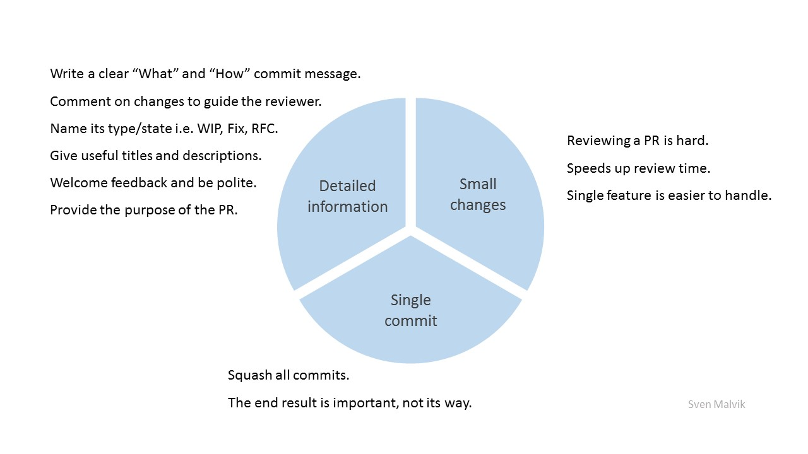
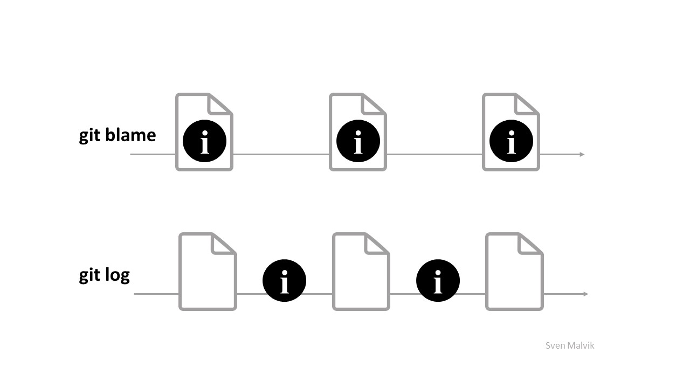

= Insights

== A pull request must be understand by others.
Comments on Pull Requests

== Deep dive into tour task.
Takeaways from the book "The McKinsey Way".

image::the-mckinsey-way/the-mckinsey-way.jpg[the-mckinsey-way]

== Git blame won't tell you what's deleted. It's git log that knows about the past.
Git blame vs. git log

