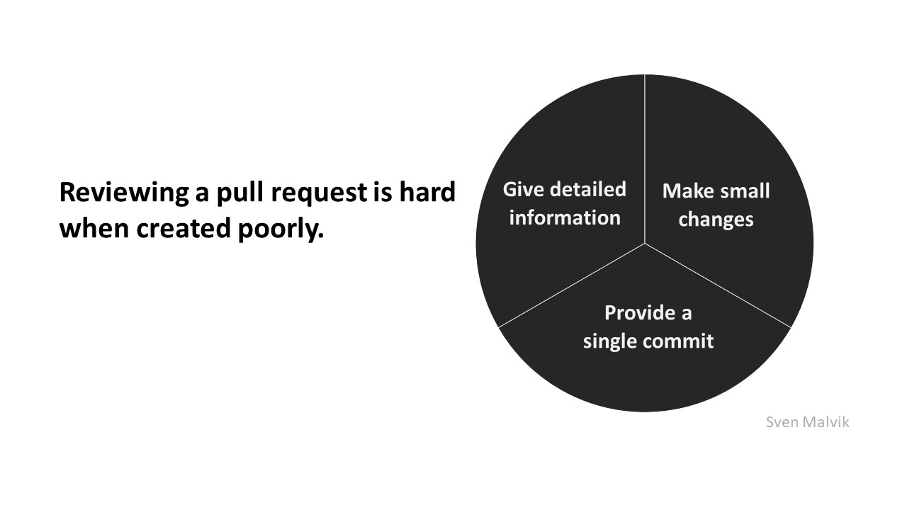
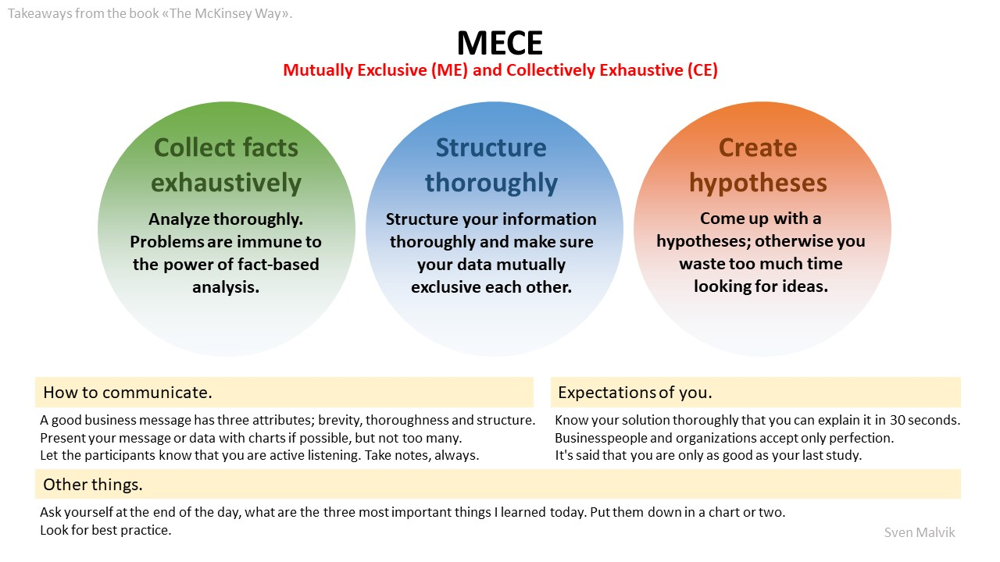

= Insights

image::ambassador-pattern.jpg[Ambassador Pattern]

image::squash.jpg[git squash]

== Deep dive into tour task.
Takeaways from the book "The McKinsey Way".

== Git blame won't tell you what's deleted. It's git log that knows about the past.
Git blame vs. git log

image::git.jpg[git blame vs. git log]

